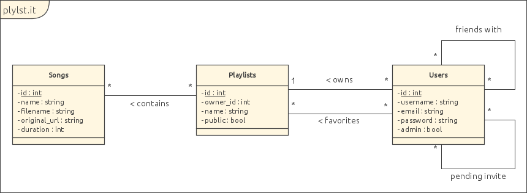
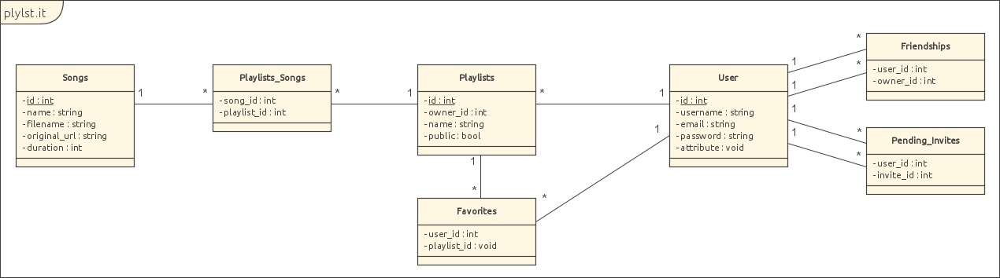

Rapport
=======

Description
-----------

plylst.it (prononcé "playlist it") est un outil de création de liste de lecture musicale. Son atout principal est la conversion de musique à partir de vidéo YouTube, de morceau SoundCloud, et autres services de streaming, vers du HTML5.

Fonctionnement
--------------

Un utilisateur inscrit peut créer une liste de lecture (publique ou privée) et y ajouter des morceaux. En pratique, il lui suffit d'envoyer le lien du média désiré et le serveur se charge de télécharger le fichier désigné. S'il s'agit d'une vidéo (lors d'utilisation de liens Youtube par exemple) la piste audio est extraite. Enfin, le fichier audio est transcodé de manière à en avoir plusieurs versions (en ogg et mp3 au minimum) afin de supporter le plus large panel de navigateurs.

Les listes de lectures ainsi constituées peuvent être écoutées via l'interface web du site. Lors de la lecture, le navigateur du client récupère et lit un fichier musical à la fois, en récupérant dynamiquement le suivant de la liste une fois qu'une piste se termine.

Un système interne d'amitiés permet à des utilisateurs de se partager les listes et il est possible de mémoriser des listes en tant que favoris.

Schéma de base de données
-------------------------

Le diagramme UML de la base de données est le suivant:

En y intégrant les tables d'association pour les relations de types N-N, on obtient:

Cas d’utilisation et définition des droits des utilisateurs
-----------------------------------------------------------

Un visiteur peut:
- écouter des playlists publiques
- créer un compte
- se connecter

Un utilisateur connecté peut:
- créer des playlists
- ajouter/supprimer les morceaux de ses playlists
- écouter des playlists publiques
- écouter ses playlists privées
- écouter les playlists privées de ses amis
- ajouter/supprimer des amis
- accepter des invitations d'amis
- ajouter/supprimer des playlists en favoris
- se déconnecter

Un administrateur peut:
- faire la même chose qu'un utilisateur
- écouter n'importe quelles playlists
- supprimer les morceaux de n'impote quelles playlists
- supprimer n'importe quelles playlists

Plan des itérations
-------------------

Pour le planning des itérations, nous avons choisi de commencer par les vues, base de données, controlleur bas niveau pour finalement joindre les deux bouts grâce au controlleur.

### Itération 1

Création de la base de donnée et des différentes vues (statiques)

### Itération 2

Système de conversion et stockage des fichiers audio
Création des controlleurs de création/modification/suppression des playlists

### Itération 3

Création du système de comptes et d'administration
Création des controlleurs de création du compte/connexion/déconnexion
Création du système d'écoute de playlists

### Itération 4

Création du système d'ami
Ajout de la fonctionnalité de favoris
Tests
